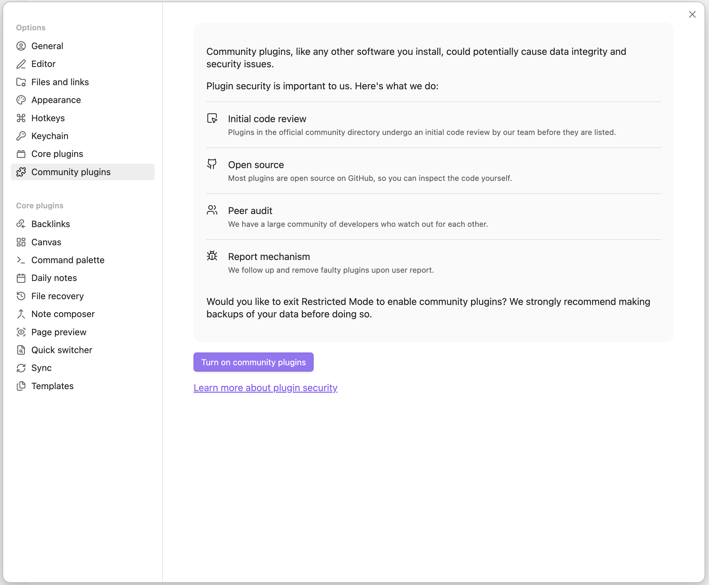
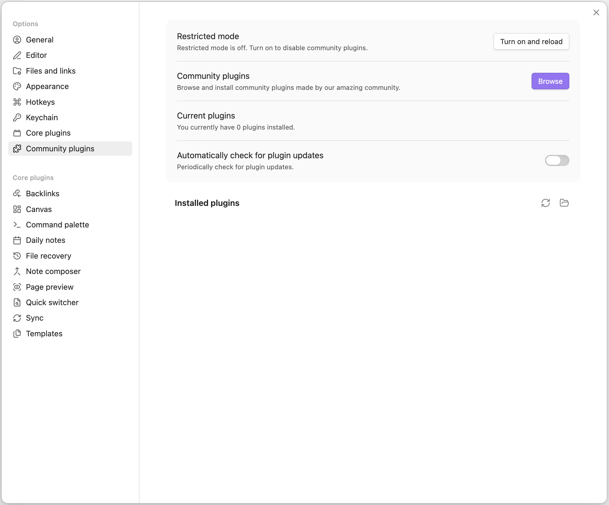
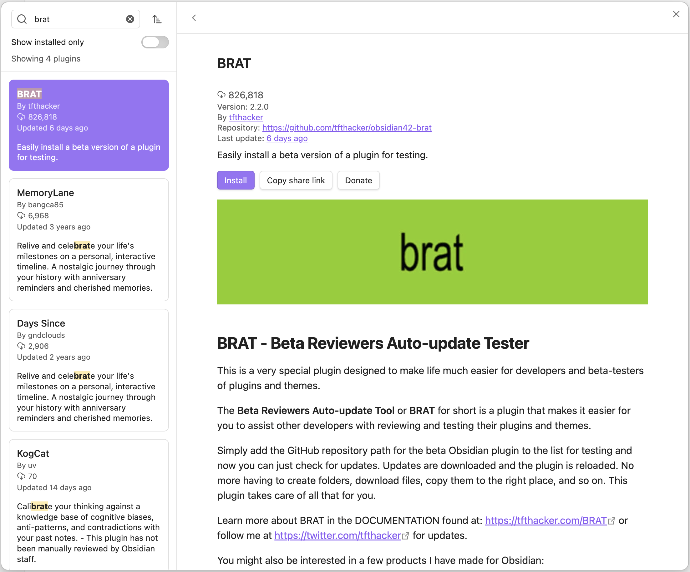
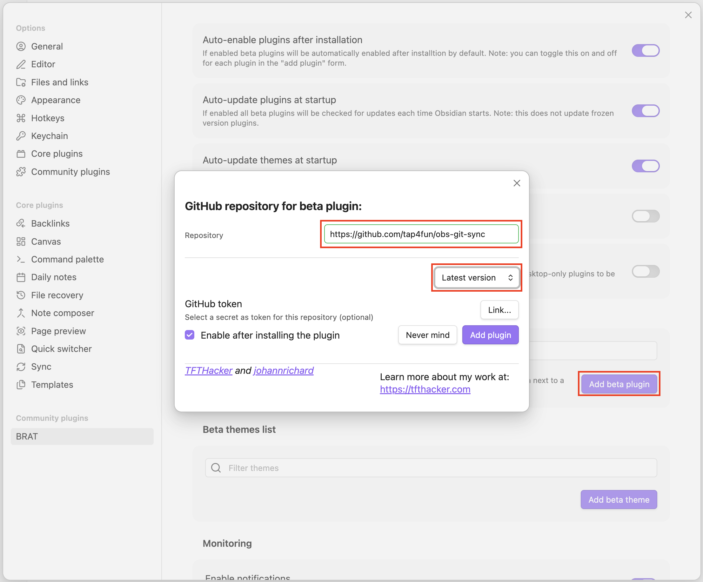
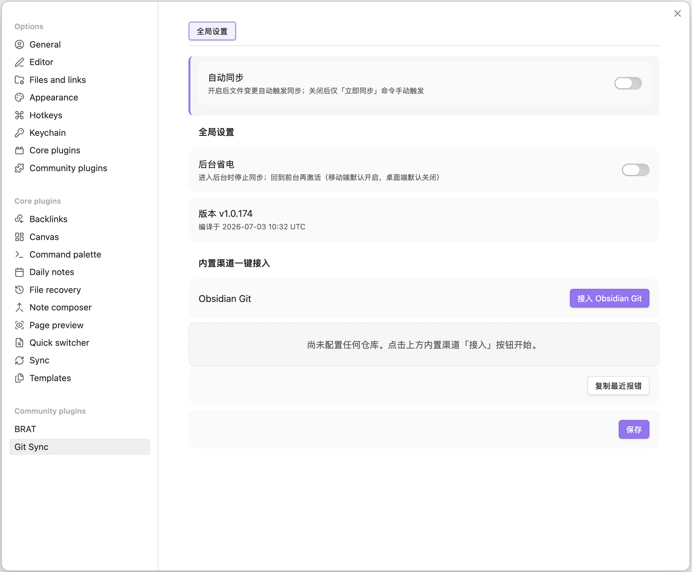
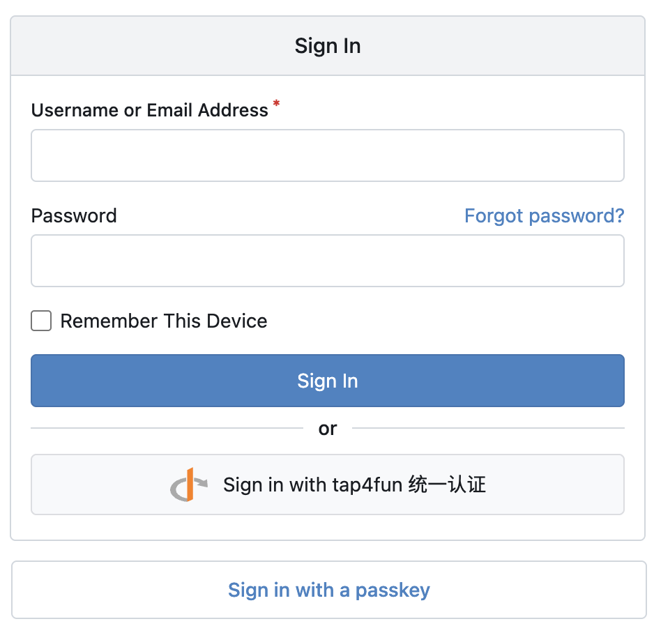
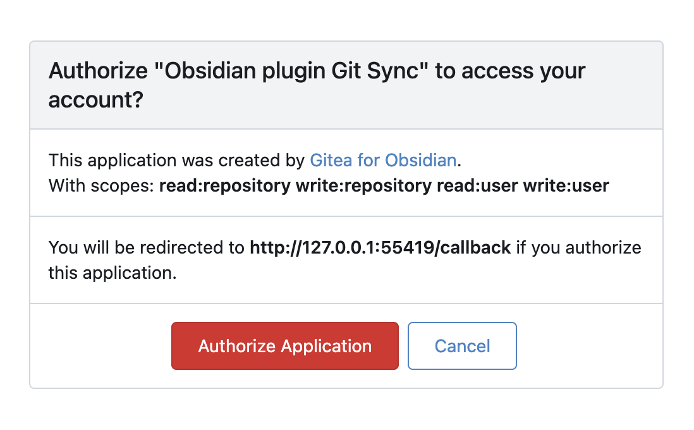
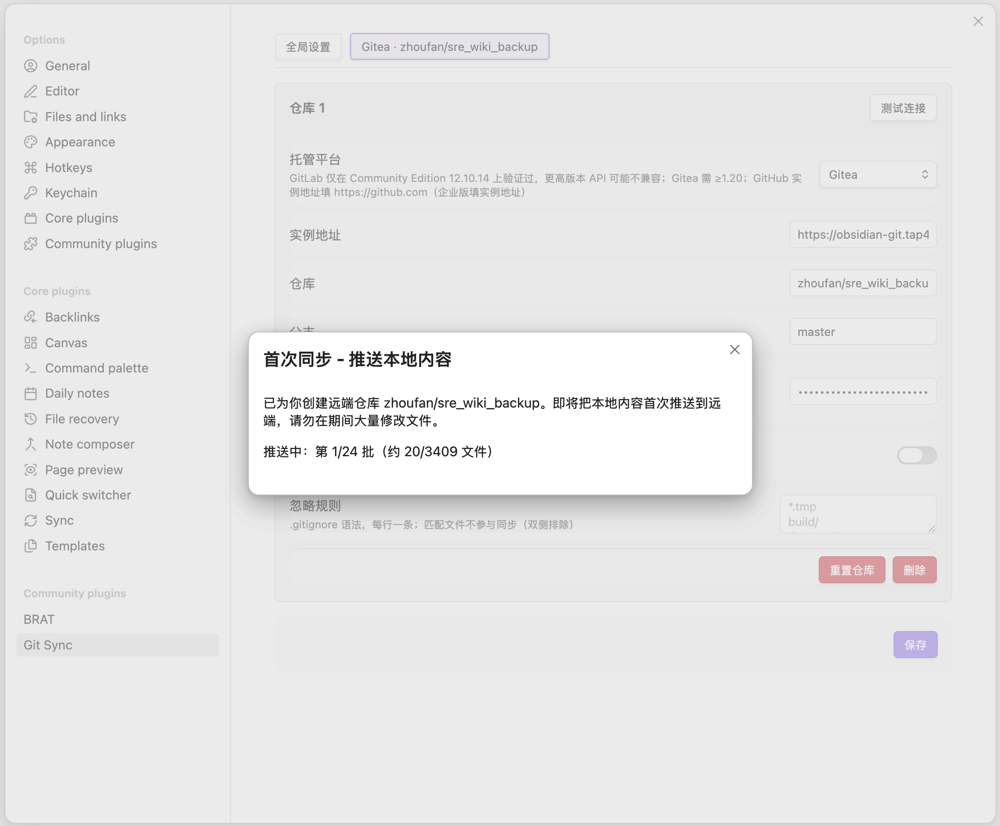
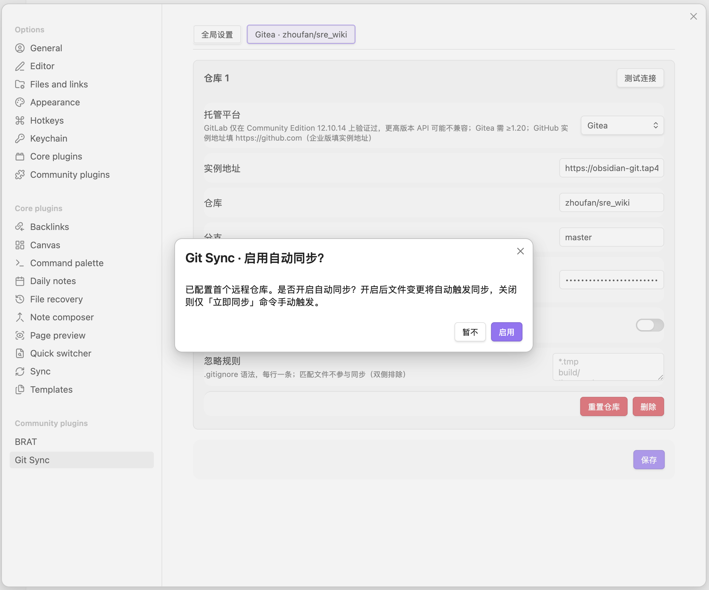
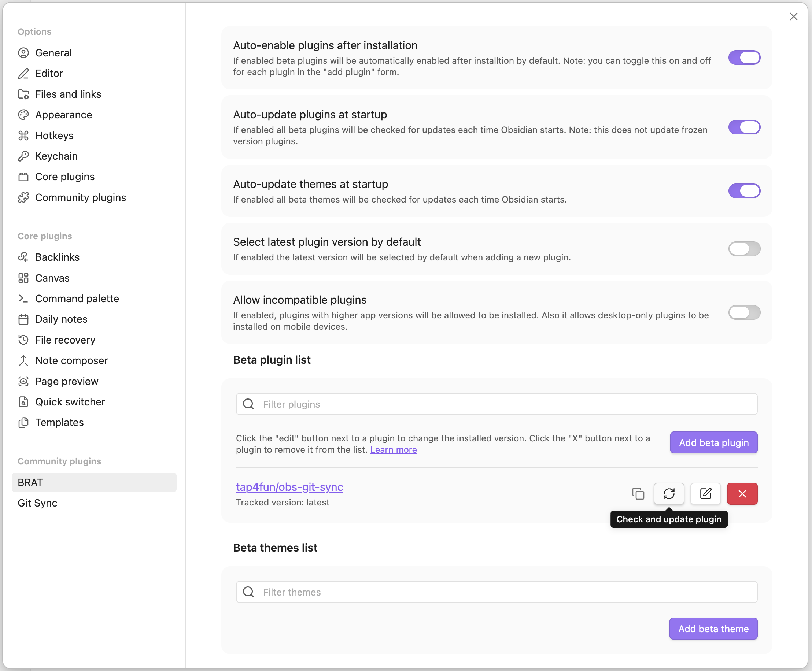

# obs-git-sync 发布仓库

> [!CAUTION]
> **首次使用请务必备份原始数据后再安装插件。** 备份方法：完全退出 Obsidian，把整个 vault 文件夹（含 `.obsidian` 子目录）复制或压缩到另一位置（如移动硬盘、网盘）；手机端可用系统文件管理器复制 vault 目录后导出。确认备份可打开后再继续安装。

Obsidian 插件 Git Sync 的内部发布通道，仅含构建产物，桌面 / Android / iOS 通用。经 BRAT（Beta Reviewers Auto-update Tester）安装并自动检查更新。

## 安装（BRAT，推荐）

### 1. 退出受限模式，启用社区插件

设置 → Community plugins → `Turn on community plugins`。

### 2. 打开社区插件市场

点击 `Community plugins` 右侧的 `Browse`。

### 3. 搜索并安装 BRAT

在搜索框输入 `brat`，选择 BRAT (by TfTHacker) → `Install` → `Enable`。

### 4. 用 BRAT 添加 Git Sync

BRAT 设置页 → `Add beta plugin`：

- Repository：`tap4fun/obs-git-sync`
- 版本选 `Latest version`
- 勾选 `Enable after installing the plugin`
- 点击 `Add plugin`

### 5. 接入远端仓库

设置 → 第三方插件 → Git Sync → 点击「接入 Obsidian Git」。

### 6. 登录 Gitea

浏览器自动跳转到 Gitea 登录页，用账号或统一认证登录。

### 7. 授权 Git Sync

授权页确认 scopes（`read:repository write:repository read:user write:user`）→ `Authorize Application`。授权后浏览器自动回跳 Obsidian，无需手动复制 token。

### 8. 首次同步

授权成功后自动创建远端仓库并推送本地内容，弹窗显示分批进度。等待推送完成即可。

### 9. 启用自动同步

首次推送结束后，弹窗询问是否开启自动同步。启用后文件变更会自动触发同步，关闭则仅经「立即同步」命令手动触发。

## 更新插件

BRAT 设置 → Beta plugin list → 找到本插件 → 点击右侧的「Check and update plugin」按钮即可拉取最新版本。开启 BRAT 的 `Auto-update plugins at startup` 后每次启动 Obsidian 自动检查更新。

## 手动安装（不推荐）

从 Releases 下载 `main.js`、`manifest.json` 与 `styles.css`，放入
`<vault>/.obsidian/plugins/obs-git-sync/`，重启 Obsidian 后启用。手动安装不会自动更新，请优先走 BRAT。
